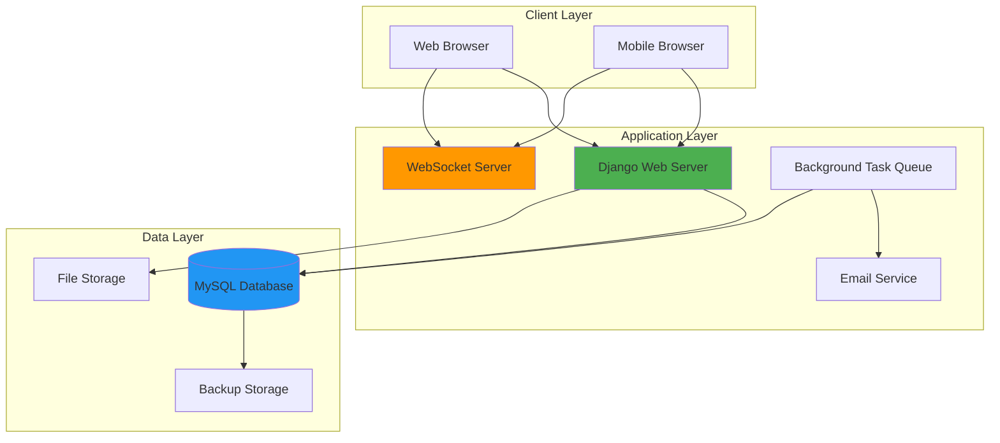
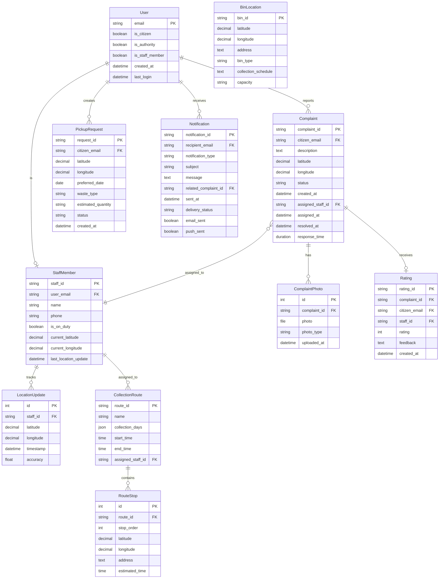

# Design Document: Garbage Collection Management System

## Overview

The Garbage Collection Management System is a web-based platform built using Django MVT (Model-View-Template) architecture that connects citizens with municipal waste management authorities. The system provides a comprehensive solution for waste management operations including complaint reporting, staff assignment, real-time tracking, route scheduling, and analytics.

### System Architecture

The system follows a three-tier architecture:

1. **Presentation Layer**: Mobile-responsive Bootstrap-based UI with HTML, CSS, and JavaScript
2. **Application Layer**: Django backend implementing business logic, authentication, and API endpoints
3. **Data Layer**: MySQL database for persistent storage

### Key Technical Components

- **Authentication System**: Email-based OTP authentication with secure session management
- **Real-time Tracking**: WebSocket-based location updates for staff monitoring
- **Notification System**: Email and browser push notification delivery
- **Map Integration**: Interactive mapping for bin locations, complaint locations, and staff tracking
- **Analytics Engine**: Data aggregation and visualization for operational insights
- **File Storage**: Secure image upload and storage for complaint documentation

## Architecture

### System Architecture Diagram



### Component Architecture

The system is organized into the following Django apps:

1. **authentication**: User registration, OTP generation/validation, session management
2. **complaints**: Complaint creation, management, and resolution tracking
3. **pickups**: Pickup request scheduling and management
4. **staff**: Staff member management, assignment, and location tracking
5. **routes**: Collection route planning and scheduling
6. **bins**: Garbage bin location management and mapping
7. **notifications**: Email and push notification delivery
8. **analytics**: Data aggregation, reporting, and dashboard generation
9. **api**: RESTful API endpoints for frontend-backend communication

### Communication Patterns

- **HTTP/HTTPS**: Standard request-response for CRUD operations
- **WebSocket**: Real-time bidirectional communication for location tracking
- **AJAX**: Asynchronous updates for dynamic UI elements
- **Background Tasks**: Celery for scheduled jobs (reports, backups, notifications)

## Components and Interfaces

### Authentication Component

**Responsibilities:**
- User registration and email validation
- OTP generation, storage, and validation
- Session creation and management
- Security enforcement (CSRF, HTTPS)

**Key Classes:**

```python
class User(AbstractBaseUser):
    email: EmailField (unique, primary key)
    is_citizen: BooleanField
    is_authority: BooleanField
    is_staff_member: BooleanField
    created_at: DateTimeField
    last_login: DateTimeField

class OTP:
    email: ForeignKey(User)
    code: CharField (6 digits)
    created_at: DateTimeField
    expires_at: DateTimeField
    is_used: BooleanField
```

**Interfaces:**

```python
# POST /api/auth/register
Request: {"email": "user@example.com"}
Response: {"message": "OTP sent", "expires_in": 600}

# POST /api/auth/verify-otp
Request: {"email": "user@example.com", "otp": "123456"}
Response: {"token": "session_token", "user_type": "citizen"}

# POST /api/auth/logout
Request: {"token": "session_token"}
Response: {"message": "Logged out successfully"}
```

### Complaint Management Component

**Responsibilities:**
- Complaint submission and validation
- Photo upload and storage
- Status tracking and updates
- Filtering and sorting

**Key Classes:**

```python
class Complaint:
    complaint_id: CharField (unique, auto-generated)
    citizen: ForeignKey(User)
    description: TextField (10-500 chars)
    latitude: DecimalField (-90 to 90)
    longitude: DecimalField (-180 to 180)
    status: CharField (pending/assigned/in-progress/resolved/closed)
    created_at: DateTimeField
    assigned_staff: ForeignKey(StaffMember, nullable)
    assigned_at: DateTimeField (nullable)
    resolved_at: DateTimeField (nullable)
    response_time: DurationField (nullable)

class ComplaintPhoto:
    complaint: ForeignKey(Complaint)
    photo: ImageField
    photo_type: CharField (before/after)
    uploaded_at: DateTimeField
```

**Interfaces:**

```python
# POST /api/complaints/create
Request: {
    "description": "Overflowing garbage bin",
    "latitude": 40.7128,
    "longitude": -74.0060,
    "photos": [File, File, File]  # max 3
}
Response: {
    "complaint_id": "CMP-2024-001234",
    "status": "pending",
    "created_at": "2024-01-15T10:30:00Z"
}

# GET /api/complaints/list
Query Params: {
    "status": "pending",
    "date_from": "2024-01-01",
    "date_to": "2024-01-31",
    "sort_by": "created_at"
}
Response: {
    "complaints": [...]
}

# PUT /api/complaints/{complaint_id}/assign
Request: {"staff_id": "STF-001"}
Response: {"status": "assigned", "assigned_at": "..."}
```

### Pickup Request Component

**Responsibilities:**
- Pickup request creation and validation
- Date validation (24-hour minimum)
- Request status management

**Key Classes:**

```python
class PickupRequest:
    request_id: CharField (unique, auto-generated)
    citizen: ForeignKey(User)
    latitude: DecimalField
    longitude: DecimalField
    preferred_date: DateField
    waste_type: CharField (general/recyclable/organic)
    estimated_quantity: CharField
    status: CharField (pending/scheduled/completed/cancelled)
    created_at: DateTimeField
```

**Interfaces:**

```python
# POST /api/pickups/create
Request: {
    "latitude": 40.7128,
    "longitude": -74.0060,
    "preferred_date": "2024-01-17",
    "waste_type": "recyclable",
    "estimated_quantity": "2 bags"
}
Response: {
    "request_id": "PKP-2024-001234",
    "status": "pending"
}
```

### Staff Management Component

**Responsibilities:**
- Staff member profile management
- Location tracking and updates
- Assignment management
- Workload monitoring

**Key Classes:**

```python
class StaffMember:
    staff_id: CharField (unique)
    user: OneToOneField(User)
    name: CharField
    phone: CharField
    is_on_duty: BooleanField
    current_latitude: DecimalField (nullable)
    current_longitude: DecimalField (nullable)
    last_location_update: DateTimeField (nullable)

class LocationUpdate:
    staff: ForeignKey(StaffMember)
    latitude: DecimalField
    longitude: DecimalField
    timestamp: DateTimeField
    accuracy: FloatField
```

**Interfaces:**

```python
# WebSocket /ws/staff/location
Message: {
    "staff_id": "STF-001",
    "latitude": 40.7128,
    "longitude": -74.0060,
    "timestamp": "2024-01-15T10:30:00Z"
}

# GET /api/staff/active-locations
Response: {
    "staff_locations": [
        {
            "staff_id": "STF-001",
            "name": "John Doe",
            "latitude": 40.7128,
            "longitude": -74.0060,
            "status": "in-progress",
            "assigned_complaints": 3
        }
    ]
}
```

### Route Management Component

**Responsibilities:**
- Collection route creation and scheduling
- Time window validation
- Route visibility for citizens

**Key Classes:**

```python
class CollectionRoute:
    route_id: CharField (unique)
    name: CharField
    collection_days: JSONField  # ["Monday", "Wednesday"]
    start_time: TimeField
    end_time: TimeField
    assigned_staff: ForeignKey(StaffMember, nullable)

class RouteStop:
    route: ForeignKey(CollectionRoute)
    stop_order: IntegerField
    latitude: DecimalField
    longitude: DecimalField
    address: TextField
    estimated_time: TimeField
```

**Interfaces:**

```python
# POST /api/routes/create
Request: {
    "name": "Downtown Route A",
    "collection_days": ["Monday", "Wednesday", "Friday"],
    "start_time": "08:00",
    "end_time": "16:00",
    "stops": [
        {"latitude": 40.7128, "longitude": -74.0060, "address": "..."}
    ]
}
Response: {"route_id": "RTE-001"}

# GET /api/routes/by-location
Query Params: {"latitude": 40.7128, "longitude": -74.0060}
Response: {"routes": [...]}
```

### Bin Location Component

**Responsibilities:**
- Bin location management
- Map display and filtering
- Distance calculation

**Key Classes:**

```python
class BinLocation:
    bin_id: CharField (unique)
    latitude: DecimalField
    longitude: DecimalField
    address: TextField
    bin_type: CharField (general/recyclable/organic)
    collection_schedule: TextField
    capacity: CharField
```

**Interfaces:**

```python
# GET /api/bins/nearby
Query Params: {
    "latitude": 40.7128,
    "longitude": -74.0060,
    "radius_km": 2,
    "bin_type": "recyclable"
}
Response: {
    "bins": [
        {
            "bin_id": "BIN-001",
            "latitude": 40.7130,
            "longitude": -74.0062,
            "distance_km": 0.3,
            "bin_type": "recyclable",
            "collection_schedule": "Mon, Wed, Fri"
        }
    ]
}
```

### Notification Component

**Responsibilities:**
- Email notification delivery
- Browser push notification delivery
- Notification templating
- Delivery tracking

**Key Classes:**

```python
class Notification:
    notification_id: CharField (unique)
    recipient: ForeignKey(User)
    notification_type: CharField (assignment/status_change/resolution)
    subject: CharField
    message: TextField
    related_complaint: ForeignKey(Complaint, nullable)
    sent_at: DateTimeField
    delivery_status: CharField (pending/sent/failed)
    email_sent: BooleanField
    push_sent: BooleanField
```

**Interfaces:**

```python
# Internal API (called by other components)
def send_notification(
    recipient: User,
    notification_type: str,
    subject: str,
    message: str,
    related_complaint: Complaint = None
) -> Notification
```

### Analytics Component

**Responsibilities:**
- Data aggregation and calculation
- Dashboard data generation
- Report generation
- Data export

**Key Classes:**

```python
class AnalyticsSnapshot:
    snapshot_id: CharField (unique)
    snapshot_date: DateField
    total_complaints: IntegerField
    pending_complaints: IntegerField
    resolved_complaints: IntegerField
    average_response_time: DurationField
    complaints_by_neighborhood: JSONField

class Report:
    report_id: CharField (unique)
    report_type: CharField (daily/weekly/monthly)
    generated_at: DateTimeField
    date_from: DateField
    date_to: DateField
    report_data: JSONField
    pdf_file: FileField
```

**Interfaces:**

```python
# GET /api/analytics/dashboard
Query Params: {"date_from": "2024-01-01", "date_to": "2024-01-31"}
Response: {
    "total_complaints": 1250,
    "by_status": {
        "pending": 45,
        "assigned": 120,
        "in-progress": 85,
        "resolved": 950,
        "closed": 50
    },
    "average_response_time_hours": 4.5,
    "complaint_trend": [...]
}

# POST /api/analytics/export
Request: {"format": "csv", "date_from": "...", "date_to": "..."}
Response: {"download_url": "/downloads/analytics-2024-01.csv"}
```

### Rating and Feedback Component

**Responsibilities:**
- Rating collection
- Feedback storage
- Staff performance calculation

**Key Classes:**

```python
class Rating:
    rating_id: CharField (unique)
    complaint: OneToOneField(Complaint)
    citizen: ForeignKey(User)
    staff: ForeignKey(StaffMember)
    rating: IntegerField (1-5)
    feedback: TextField (max 300 chars, nullable)
    created_at: DateTimeField
```

**Interfaces:**

```python
# POST /api/ratings/submit
Request: {
    "complaint_id": "CMP-2024-001234",
    "rating": 5,
    "feedback": "Excellent service, very prompt!"
}
Response: {"message": "Rating submitted", "complaint_status": "closed"}
```

## Data Models

### Entity Relationship Diagram



### Database Schema Details

#### Users Table
- **Primary Key**: email (VARCHAR(255))
- **Indexes**: created_at, is_citizen, is_authority, is_staff_member
- **Constraints**: email must be unique and valid format

#### Complaints Table
- **Primary Key**: complaint_id (VARCHAR(50))
- **Foreign Keys**: citizen_email → Users(email), assigned_staff_id → StaffMembers(staff_id)
- **Indexes**: status, created_at, citizen_email, assigned_staff_id, (latitude, longitude)
- **Constraints**: 
  - description length 10-500 characters
  - latitude between -90 and 90
  - longitude between -180 and 180
  - status in (pending, assigned, in-progress, resolved, closed)

#### ComplaintPhotos Table
- **Primary Key**: id (AUTO_INCREMENT)
- **Foreign Keys**: complaint_id → Complaints(complaint_id) ON DELETE CASCADE
- **Indexes**: complaint_id, photo_type
- **Constraints**: 
  - photo_type in (before, after)
  - max 3 photos per complaint (enforced at application level)
  - max file size 5MB (enforced at application level)

#### PickupRequests Table
- **Primary Key**: request_id (VARCHAR(50))
- **Foreign Keys**: citizen_email → Users(email)
- **Indexes**: status, preferred_date, citizen_email
- **Constraints**: 
  - preferred_date >= CURRENT_DATE + 1
  - waste_type in (general, recyclable, organic)
  - status in (pending, scheduled, completed, cancelled)

#### StaffMembers Table
- **Primary Key**: staff_id (VARCHAR(50))
- **Foreign Keys**: user_email → Users(email) UNIQUE
- **Indexes**: is_on_duty, last_location_update
- **Constraints**: phone must be valid format

#### LocationUpdates Table
- **Primary Key**: id (AUTO_INCREMENT)
- **Foreign Keys**: staff_id → StaffMembers(staff_id)
- **Indexes**: staff_id, timestamp
- **Constraints**: timestamp must be recent (within 5 minutes)

#### CollectionRoutes Table
- **Primary Key**: route_id (VARCHAR(50))
- **Foreign Keys**: assigned_staff_id → StaffMembers(staff_id)
- **Indexes**: assigned_staff_id
- **Constraints**: start_time < end_time

#### RouteStops Table
- **Primary Key**: id (AUTO_INCREMENT)
- **Foreign Keys**: route_id → CollectionRoutes(route_id) ON DELETE CASCADE
- **Indexes**: route_id, stop_order
- **Constraints**: stop_order must be unique within route

#### BinLocations Table
- **Primary Key**: bin_id (VARCHAR(50))
- **Indexes**: bin_type, (latitude, longitude)
- **Constraints**: bin_type in (general, recyclable, organic)

#### Notifications Table
- **Primary Key**: notification_id (VARCHAR(50))
- **Foreign Keys**: recipient_email → Users(email), related_complaint_id → Complaints(complaint_id)
- **Indexes**: recipient_email, sent_at, delivery_status
- **Constraints**: 
  - notification_type in (assignment, status_change, resolution)
  - delivery_status in (pending, sent, failed)

#### Ratings Table
- **Primary Key**: rating_id (VARCHAR(50))
- **Foreign Keys**: 
  - complaint_id → Complaints(complaint_id) UNIQUE
  - citizen_email → Users(email)
  - staff_id → StaffMembers(staff_id)
- **Indexes**: staff_id, created_at
- **Constraints**: 
  - rating between 1 and 5
  - feedback max 300 characters

#### ArchivedComplaints Table
- Same schema as Complaints table
- Used for complaints closed > 90 days
- Separate table for performance optimization

### Data Validation Rules

1. **Email Validation**: RFC 5322 standard format
2. **Coordinate Validation**: Latitude (-90 to 90), Longitude (-180 to 180)
3. **File Upload Validation**: 
   - Check file headers (magic numbers) to verify actual file type
   - Allowed extensions: .jpg, .jpeg, .png, .webp
   - Max size: 5MB per file
4. **Text Length Validation**:
   - Complaint description: 10-500 characters
   - Feedback: 0-300 characters
5. **Date Validation**: Pickup dates must be at least 24 hours in future
6. **OTP Validation**: 6-digit numeric code, expires after 10 minutes


## Correctness Properties

*A property is a characteristic or behavior that should hold true across all valid executions of a system-essentially, a formal statement about what the system should do. Properties serve as the bridge between human-readable specifications and machine-verifiable correctness guarantees.*

### Property 1: OTP Authentication Round Trip

*For any* valid email address, when a user registers and receives an OTP, entering that OTP within 10 minutes should successfully authenticate the user and grant access.

**Validates: Requirements 1.1, 1.2**

### Property 2: Expired OTP Rejection

*For any* OTP that was generated more than 10 minutes ago, attempting to authenticate with it should be rejected by the system.

**Validates: Requirements 1.3**

### Property 3: OTP Invalidation on New Request

*For any* email address with an existing unused OTP, when a new login is requested, the old OTP should be invalidated and only the new OTP should work for authentication.

**Validates: Requirements 1.5**

### Property 4: Complaint Data Completeness

*For any* valid complaint submission with description, location coordinates, and optional photos, all provided data should be stored in the database and retrievable.

**Validates: Requirements 2.1**

### Property 5: Complaint Description Length Validation

*For any* string, it should be accepted as a complaint description if and only if its length is between 10 and 500 characters inclusive.

**Validates: Requirements 2.2**

### Property 6: Photo Upload Format and Size Validation

*For any* file upload, it should be accepted as a complaint photo if and only if it is in JPEG, PNG, or WebP format (verified by file header) and is 5MB or smaller.

**Validates: Requirements 2.3, 16.5**

### Property 7: Photo Count Limit

*For any* complaint, attempting to attach more than 3 photos should be rejected by the system.

**Validates: Requirements 2.4**

### Property 8: Unique ID Generation

*For any* set of complaints and pickup requests created in the system, all complaint IDs and all request IDs should be unique.

**Validates: Requirements 2.5, 3.4**

### Property 9: Initial Status Assignment

*For any* newly created complaint or pickup request, the initial status should be set to "pending".

**Validates: Requirements 2.6, 3.3**

### Property 10: Complaint Confirmation Response

*For any* successfully submitted complaint, the system response should contain the assigned complaint ID.

**Validates: Requirements 2.7**

### Property 11: Pickup Request Data Completeness

*For any* valid pickup request with location, preferred date, waste type, and estimated quantity, all provided data should be stored in the database and retrievable.

**Validates: Requirements 3.1**

### Property 12: Pickup Date Validation

*For any* date, it should be accepted as a preferred pickup date if and only if it is at least 24 hours in the future from the current time.

**Validates: Requirements 3.2**

### Property 13: Complaint List Completeness

*For any* complaint in the database, when authorities view the complaint list, the complaint should appear with all required fields: complaint ID, location, description, photos, timestamp, and resolution status.

**Validates: Requirements 4.1**

### Property 14: Complaint Filtering Correctness

*For any* filter criteria (status, date range, or location), the filtered complaint list should contain only complaints that match all specified criteria.

**Validates: Requirements 4.2**

### Property 15: Complaint Sorting Correctness

*For any* sort field (timestamp, location, or status), the sorted complaint list should be ordered according to that field in the specified direction.

**Validates: Requirements 4.3**

### Property 16: Complaint Detail Completeness

*For any* complaint, when an authority views its details, the response should include all complaint information plus citizen contact information.

**Validates: Requirements 4.4**

### Property 17: Staff Assignment Status Update

*For any* complaint, when a staff member is assigned to it, the resolution status should be updated to "assigned" and the assignment timestamp should be recorded.

**Validates: Requirements 5.1**

### Property 18: Staff Assignment Data Storage

*For any* staff assignment to a complaint, the staff member's ID, name, and contact information should be stored and associated with the complaint.

**Validates: Requirements 5.2**

### Property 19: Assignment Notification Delivery

*For any* staff assignment to a complaint, notifications should be sent to both the assigned staff member and the citizen who filed the complaint.

**Validates: Requirements 5.3, 5.4, 8.1**

### Property 20: Staff Workload Limit

*For any* staff member who already has 10 or more active (non-closed) complaints assigned, attempting to assign another complaint should be rejected by the system.

**Validates: Requirements 5.5**

### Property 21: Location Update Storage

*For any* location update received from an on-duty staff member, the location coordinates and timestamp should be stored in the database.

**Validates: Requirements 6.1**

### Property 22: Staff Location Display Completeness

*For any* on-duty staff member with a recent location update, the map interface should display their location marker with current status information.

**Validates: Requirements 6.2**

### Property 23: ETA Calculation

*For any* staff member with a current location and an assigned complaint location, the system should calculate and display an estimated time of arrival based on the distance between the two locations.

**Validates: Requirements 6.3**

### Property 24: In-Progress Status Update

*For any* complaint with an assigned staff member, when the staff member is traveling toward the complaint location, the resolution status should be updated to "in-progress".

**Validates: Requirements 6.4**

### Property 25: Resolution Photo Requirement

*For any* attempt to mark a complaint as resolved, it should be rejected if no "after" photo is provided.

**Validates: Requirements 7.1**

### Property 26: Resolution Data Storage

*For any* complaint marked as resolved, the resolution timestamp and after photos should be stored in the database.

**Validates: Requirements 7.2**

### Property 27: Resolution Status Update and Notification

*For any* complaint marked as resolved, the resolution status should be updated to "resolved" and a notification with resolution details and photos should be sent to the citizen.

**Validates: Requirements 7.3, 8.3**

### Property 28: Response Time Calculation

*For any* resolved complaint, the response time should be calculated as the duration between the complaint creation timestamp and the resolution timestamp.

**Validates: Requirements 7.4**

### Property 29: Status Change Notification

*For any* complaint status change (to assigned, in-progress, or resolved), a notification should be sent to the citizen within a reasonable time frame.

**Validates: Requirements 8.2, 8.4**

### Property 30: Conditional Push Notification

*For any* citizen who has enabled browser notifications, when their complaint status changes, both email and browser push notifications should be sent.

**Validates: Requirements 8.5**

### Property 31: Bin Location Map Display

*For any* bin location in the database, it should appear on the interactive map with a marker.

**Validates: Requirements 9.1**

### Property 32: Distance Calculation to Bins

*For any* citizen location and set of bin locations, the system should calculate the distance from the citizen to each bin.

**Validates: Requirements 9.2**

### Property 33: Bin Type Filtering

*For any* bin type filter (general, recyclable, or organic), the filtered bin list should contain only bins of that type.

**Validates: Requirements 9.3**

### Property 34: Bin Detail Completeness

*For any* bin location, when selected on the map, the displayed details should include address, type, and collection schedule.

**Validates: Requirements 9.4**

### Property 35: Collection Route Data Completeness

*For any* collection route created by an authority, all provided data (route name, scheduled stops, collection days, and time windows) should be stored and retrievable.

**Validates: Requirements 10.1**

### Property 36: Time Window Overlap Prevention

*For any* staff member, attempting to create collection routes with overlapping time windows on the same day should be rejected by the system.

**Validates: Requirements 10.2**

### Property 37: Route Visibility to Citizens

*For any* collection route stored in the database, it should be visible and accessible to citizens.

**Validates: Requirements 10.3**

### Property 38: Location-Based Route Filtering

*For any* citizen with a registered location, when viewing collection schedules, only routes relevant to their location should be displayed.

**Validates: Requirements 10.4**

### Property 39: Complaint Count by Status

*For any* time period, the analytics dashboard should display accurate counts of complaints grouped by resolution status.

**Validates: Requirements 11.1**

### Property 40: Average Response Time Calculation

*For any* set of resolved complaints in a neighborhood or overall, the calculated average response time should equal the sum of all response times divided by the count of complaints.

**Validates: Requirements 11.2**

### Property 41: Complaint Volume Trend Data

*For any* 30-day period, the system should generate accurate daily complaint volume data for trend visualization.

**Validates: Requirements 11.3**

### Property 42: Neighborhood Ranking Correctness

*For any* set of neighborhoods with complaint data, the ranking by response time, complaint volume, or resolution rate should be correctly ordered according to the selected metric.

**Validates: Requirements 11.4**

### Property 43: Analytics Data Export

*For any* analytics data displayed on the dashboard, the exported CSV file should contain the same data in a structured format.

**Validates: Requirements 11.5**

### Property 44: Report Generation Completeness

*For any* report type (daily, weekly, or monthly), the generated report should contain all required metrics and statistics for the specified time period.

**Validates: Requirements 12.1, 12.2, 12.3**

### Property 45: Report Storage and Delivery

*For any* generated report, it should be stored in the database and sent via email to designated authorities.

**Validates: Requirements 12.4**

### Property 46: Historical Report Download

*For any* previously generated report, authorities should be able to download it in PDF format.

**Validates: Requirements 12.5**

### Property 47: Feedback Length Validation

*For any* rating feedback text, it should be accepted if and only if its length is 300 characters or less.

**Validates: Requirements 13.2**

### Property 48: Rating Data Storage with Relationships

*For any* submitted rating, it should be stored in the database with proper links to the complaint, citizen, and staff member.

**Validates: Requirements 13.3**

### Property 49: Staff Average Rating Calculation

*For any* staff member with ratings, the displayed average rating should equal the sum of all their ratings divided by the count of ratings.

**Validates: Requirements 13.4**

### Property 50: Rating Submission Status Update

*For any* complaint, when a citizen submits a rating for it, the resolution status should be updated to "closed".

**Validates: Requirements 13.5**

### Property 51: Automatic Complaint Archiving

*For any* complaint with status "closed" for more than 90 days, it should be moved to the archive table and excluded from active complaint lists while remaining accessible for viewing.

**Validates: Requirements 14.1, 14.2**

### Property 52: Archived Complaint Search

*For any* search criteria (date range, location, or complaint ID) applied to archived complaints, the search results should contain only archived complaints matching all specified criteria.

**Validates: Requirements 14.3**

### Property 53: Touch Target Size Validation

*For any* interactive UI element on mobile devices, the touch target should be at least 44x44 pixels.

**Validates: Requirements 15.2**

### Property 54: GPS Location Capture

*For any* complaint submitted from a mobile device with GPS enabled, the system should automatically capture the device's GPS coordinates as the complaint location.

**Validates: Requirements 15.3**

### Property 55: Image Compression on Mobile Upload

*For any* image uploaded from a mobile device, the system should compress it before storage while maintaining sufficient quality.

**Validates: Requirements 15.4**

### Property 56: Validation Error Message Display

*For any* invalid data submission, the system should display a descriptive error message indicating the specific validation failure.

**Validates: Requirements 16.1**

### Property 57: Email Format Validation

*For any* string, it should be accepted as an email address if and only if it conforms to RFC 5322 standard format.

**Validates: Requirements 16.2**

### Property 58: Coordinate Range Validation

*For any* coordinate pair, it should be accepted if and only if the latitude is between -90 and 90 and the longitude is between -180 and 180.

**Validates: Requirements 16.3**

### Property 59: Database Error Handling

*For any* database operation failure, the system should log technical error details internally but display only a user-friendly error message to the user without exposing technical details.

**Validates: Requirements 16.4**

### Property 60: Session Creation with Unique Token

*For any* successful authentication, the system should create a session with a unique session token that differs from all other active session tokens.

**Validates: Requirements 17.1**

### Property 61: Session Expiration After Inactivity

*For any* session, if there is no activity for 30 minutes, the session should expire and subsequent requests should be rejected.

**Validates: Requirements 17.2**

### Property 62: Session Timeout Redirect

*For any* expired session, when a user attempts to access a protected resource, they should be redirected to the login page with a session timeout message.

**Validates: Requirements 17.3**

### Property 63: CSRF Protection Enforcement

*For any* state-changing operation (POST, PUT, DELETE), the request should be rejected if it does not include a valid CSRF token.

**Validates: Requirements 17.5**

### Property 64: Daily Backup Execution

*For any* day, the system should create a database backup at the scheduled time (2:00 AM local time).

**Validates: Requirements 18.1**

### Property 65: Backup Retention Policy

*For any* backup file older than 30 days, it should be automatically deleted from the backup storage.

**Validates: Requirements 18.2**

### Property 66: Backup Storage Separation

*For any* created backup file, it should be stored in a location separate from the primary database storage.

**Validates: Requirements 18.3**

### Property 67: Backup Integrity Verification

*For any* monthly backup verification cycle, the system should perform a test restoration to verify backup integrity.

**Validates: Requirements 18.4**

### Property 68: Backup Failure Alert

*For any* failed backup operation, an alert email should be sent to system administrators.

**Validates: Requirements 18.5**


## Error Handling

### Error Handling Strategy

The system implements a layered error handling approach with clear separation between technical errors (logged for developers) and user-facing errors (displayed to users).

### Error Categories

#### 1. Validation Errors

**Trigger**: Invalid user input (email format, coordinate range, text length, file type/size)

**Handling**:
- Validate input at the API layer before processing
- Return HTTP 400 Bad Request with descriptive error message
- Error response format:
```json
{
  "error": "validation_error",
  "message": "Complaint description must be between 10 and 500 characters",
  "field": "description",
  "provided_length": 8
}
```

**User Experience**: Display error message inline near the relevant form field

#### 2. Authentication Errors

**Trigger**: Invalid OTP, expired OTP, expired session, missing CSRF token

**Handling**:
- Return HTTP 401 Unauthorized for authentication failures
- Return HTTP 403 Forbidden for authorization failures
- Clear session data on authentication failure
- Error response format:
```json
{
  "error": "authentication_error",
  "message": "OTP has expired. Please request a new one.",
  "code": "OTP_EXPIRED"
}
```

**User Experience**: Redirect to login page with error message, preserve form data where appropriate

#### 3. Business Logic Errors

**Trigger**: Staff workload limit exceeded, time window overlap, photo count limit exceeded

**Handling**:
- Return HTTP 409 Conflict with explanation
- Error response format:
```json
{
  "error": "business_rule_violation",
  "message": "Staff member already has 10 active complaints assigned",
  "rule": "MAX_STAFF_WORKLOAD",
  "current_count": 10
}
```

**User Experience**: Display error message with actionable guidance (e.g., "Please select a different staff member")

#### 4. Database Errors

**Trigger**: Connection failure, query timeout, constraint violation, deadlock

**Handling**:
- Log full technical error details (stack trace, query, parameters)
- Return HTTP 500 Internal Server Error with generic message
- Implement retry logic for transient failures (max 3 retries with exponential backoff)
- Error response format:
```json
{
  "error": "server_error",
  "message": "Unable to process your request. Please try again later.",
  "request_id": "req_abc123"
}
```

**User Experience**: Display generic error message, provide request ID for support inquiries

#### 5. External Service Errors

**Trigger**: Email service failure, map service failure, file storage failure

**Handling**:
- Implement circuit breaker pattern to prevent cascading failures
- Queue failed operations for retry (email notifications, file uploads)
- Log service failures with context
- Return HTTP 503 Service Unavailable for critical service failures
- Error response format:
```json
{
  "error": "service_unavailable",
  "message": "Email service is temporarily unavailable. Your complaint has been saved.",
  "service": "email",
  "queued_for_retry": true
}
```

**User Experience**: Inform user that primary action succeeded but secondary action (e.g., notification) is delayed

#### 6. File Upload Errors

**Trigger**: File too large, invalid file type, malicious file detected, storage quota exceeded

**Handling**:
- Validate file size before upload (client-side and server-side)
- Check file headers (magic numbers) to verify actual file type
- Scan for malicious content patterns
- Return HTTP 413 Payload Too Large or HTTP 415 Unsupported Media Type
- Error response format:
```json
{
  "error": "file_upload_error",
  "message": "File size exceeds maximum allowed size of 5MB",
  "file_name": "photo.jpg",
  "file_size_mb": 7.2,
  "max_size_mb": 5
}
```

**User Experience**: Display error with file name and specific issue, suggest compression or alternative format

#### 7. Rate Limiting Errors

**Trigger**: Too many requests from same IP or user account

**Handling**:
- Implement rate limiting at API gateway level
- Return HTTP 429 Too Many Requests with retry-after header
- Error response format:
```json
{
  "error": "rate_limit_exceeded",
  "message": "Too many requests. Please try again in 60 seconds.",
  "retry_after_seconds": 60
}
```

**User Experience**: Display countdown timer before allowing retry

### Error Logging

All errors are logged with the following structure:

```python
{
  "timestamp": "2024-01-15T10:30:00Z",
  "level": "ERROR",
  "request_id": "req_abc123",
  "user_email": "user@example.com",
  "endpoint": "/api/complaints/create",
  "error_type": "DatabaseError",
  "error_message": "Connection timeout",
  "stack_trace": "...",
  "context": {
    "complaint_data": {...},
    "retry_count": 2
  }
}
```

### Error Recovery Mechanisms

1. **Automatic Retry**: Transient database and network errors (max 3 attempts)
2. **Queue for Later**: Failed notifications and non-critical operations
3. **Graceful Degradation**: Display cached data when real-time data unavailable
4. **Transaction Rollback**: Ensure data consistency on partial operation failures
5. **Circuit Breaker**: Prevent repeated calls to failing external services

## Testing Strategy

### Overview

The testing strategy employs a dual approach combining unit tests for specific examples and edge cases with property-based tests for comprehensive validation of universal properties. This ensures both concrete bug detection and general correctness verification.

### Testing Frameworks

- **Unit Testing**: pytest (Python)
- **Property-Based Testing**: Hypothesis (Python)
- **Integration Testing**: pytest with Django test client
- **End-to-End Testing**: Selenium WebDriver
- **API Testing**: pytest with requests library
- **Load Testing**: Locust

### Property-Based Testing Configuration

All property-based tests will use Hypothesis with the following configuration:

```python
from hypothesis import given, settings, strategies as st

@settings(max_examples=100)  # Minimum 100 iterations per test
@given(...)
def test_property_name(...):
    # Test implementation
```

Each property test must include a comment tag referencing the design document property:

```python
# Feature: garbage-collection-management-system, Property 1: OTP Authentication Round Trip
@settings(max_examples=100)
@given(email=st.emails())
def test_otp_authentication_round_trip(email):
    # Generate OTP for email
    otp = generate_otp(email)
    
    # Verify OTP within 10 minutes
    result = authenticate_with_otp(email, otp)
    
    # Assert authentication succeeds
    assert result.is_authenticated
    assert result.user_email == email
```

### Test Categories

#### 1. Authentication Tests

**Unit Tests**:
- Valid email registration creates user account
- Invalid email format is rejected
- OTP generation creates 6-digit code
- Specific OTP expiration scenarios (exactly 10 minutes, 11 minutes)

**Property Tests**:
- Property 1: OTP authentication round trip for any valid email
- Property 2: Expired OTP rejection for any OTP > 10 minutes old
- Property 3: OTP invalidation on new request for any email
- Property 60: Session creation with unique token for any authentication
- Property 61: Session expiration after 30 minutes inactivity

#### 2. Complaint Management Tests

**Unit Tests**:
- Complaint creation with all fields
- Complaint creation with minimum required fields
- Complaint with exactly 10 characters (boundary)
- Complaint with exactly 500 characters (boundary)
- Complaint with 3 photos (boundary)

**Property Tests**:
- Property 4: Complaint data completeness for any valid complaint
- Property 5: Description length validation for any string
- Property 6: Photo format and size validation for any file
- Property 7: Photo count limit for any complaint
- Property 8: Unique ID generation for any set of complaints
- Property 9: Initial status assignment for any new complaint
- Property 14: Filtering correctness for any filter criteria
- Property 15: Sorting correctness for any sort field

#### 3. Staff Assignment Tests

**Unit Tests**:
- Assign staff to complaint with 0 active complaints
- Assign staff to complaint with exactly 10 active complaints (boundary)
- Attempt to assign staff with 11 active complaints (should fail)

**Property Tests**:
- Property 17: Status update on assignment for any complaint
- Property 18: Staff data storage for any assignment
- Property 19: Notification delivery for any assignment
- Property 20: Workload limit enforcement for any staff member

#### 4. Location Tracking Tests

**Unit Tests**:
- Location update with valid coordinates
- Location update with boundary coordinates (90, 180)
- ETA calculation for specific known distances

**Property Tests**:
- Property 21: Location update storage for any valid update
- Property 22: Staff location display for any on-duty staff
- Property 23: ETA calculation for any staff and complaint location pair
- Property 58: Coordinate validation for any coordinate pair

#### 5. Notification Tests

**Unit Tests**:
- Email notification sent on specific status change
- Push notification sent when enabled
- Notification not sent when push disabled

**Property Tests**:
- Property 19: Assignment notification for any assignment
- Property 27: Resolution notification for any resolution
- Property 29: Status change notification for any status change
- Property 30: Conditional push notification for any citizen with push enabled

#### 6. Analytics Tests

**Unit Tests**:
- Average calculation with 0 complaints
- Average calculation with 1 complaint
- Ranking with tied values

**Property Tests**:
- Property 39: Complaint count by status for any time period
- Property 40: Average response time calculation for any complaint set
- Property 41: Trend data generation for any 30-day period
- Property 42: Neighborhood ranking for any neighborhood set
- Property 49: Staff average rating calculation for any staff member

#### 7. Validation Tests

**Unit Tests**:
- Specific invalid email formats (missing @, missing domain, etc.)
- Specific invalid coordinates (91, -91, 181, -181)
- Specific invalid file types (.exe, .php, .js)

**Property Tests**:
- Property 56: Error message display for any invalid input
- Property 57: Email validation for any string
- Property 58: Coordinate validation for any coordinate pair
- Property 6: File upload validation for any file

#### 8. Security Tests

**Unit Tests**:
- CSRF token validation on specific endpoints
- Session expiration at exactly 30 minutes
- File upload with mismatched extension and header

**Property Tests**:
- Property 63: CSRF protection for any state-changing operation
- Property 61: Session expiration for any session after 30 minutes
- Property 6: File header validation for any uploaded file

#### 9. Data Archiving Tests

**Unit Tests**:
- Archive complaint closed exactly 90 days ago
- Don't archive complaint closed 89 days ago
- Search archived complaints by specific ID

**Property Tests**:
- Property 51: Automatic archiving for any complaint closed > 90 days
- Property 52: Archived complaint search for any search criteria

#### 10. Integration Tests

**Scenarios**:
- Complete complaint lifecycle: create → assign → in-progress → resolve → rate → close → archive
- Pickup request flow: create → schedule → complete
- Route creation and citizen viewing
- Staff location tracking during complaint resolution
- Report generation and download
- Backup creation and restoration

### Test Data Generation

**Hypothesis Strategies**:

```python
# Email addresses
emails = st.emails()

# Complaint descriptions (10-500 chars)
descriptions = st.text(min_size=10, max_size=500)

# Coordinates
latitudes = st.floats(min_value=-90, max_value=90)
longitudes = st.floats(min_value=-180, max_value=180)

# Dates in future (for pickup requests)
future_dates = st.dates(min_value=date.today() + timedelta(days=1))

# OTP codes
otp_codes = st.text(alphabet=st.characters(whitelist_categories=('Nd',)), min_size=6, max_size=6)

# File sizes
file_sizes = st.integers(min_value=0, max_value=10*1024*1024)  # 0 to 10MB

# Ratings
ratings = st.integers(min_value=1, max_value=5)

# Status values
statuses = st.sampled_from(['pending', 'assigned', 'in-progress', 'resolved', 'closed'])
```

### Test Coverage Goals

- **Line Coverage**: Minimum 85%
- **Branch Coverage**: Minimum 80%
- **Property Coverage**: 100% of correctness properties implemented as tests
- **Critical Path Coverage**: 100% of user-facing workflows

### Continuous Integration

All tests run automatically on:
- Every pull request
- Every commit to main branch
- Nightly scheduled runs (including extended property test runs with 1000 iterations)

### Performance Testing

**Load Test Scenarios**:
1. 100 concurrent users submitting complaints
2. 50 concurrent staff members sending location updates
3. 20 concurrent authorities viewing analytics dashboard
4. Sustained load of 1000 requests/minute for 1 hour

**Performance Targets**:
- API response time: < 200ms (p95)
- Page load time: < 2 seconds (p95)
- Location update processing: < 100ms (p95)
- Database query time: < 50ms (p95)

### Test Maintenance

- Review and update tests when requirements change
- Refactor tests to reduce duplication
- Archive obsolete tests with documentation
- Monitor test execution time and optimize slow tests
- Regular review of property test failure patterns to identify edge cases

